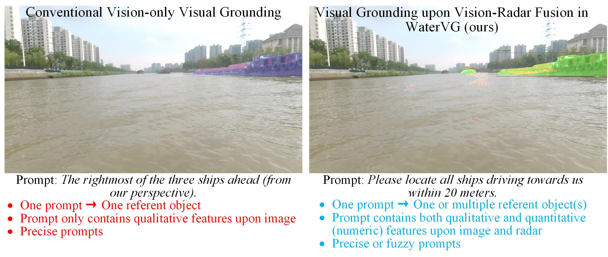
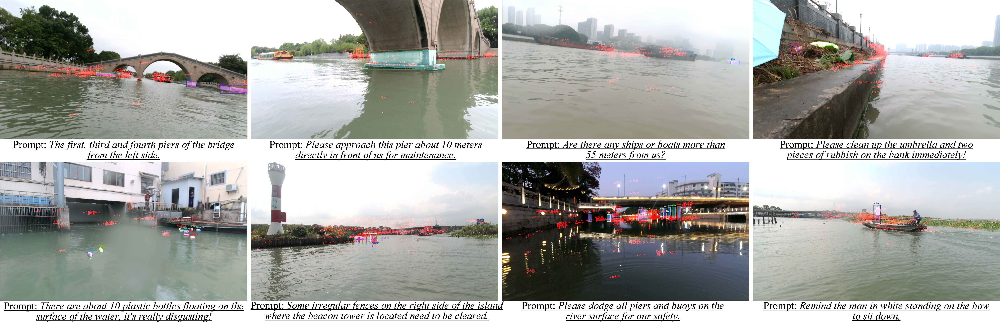

# WaterVG: Waterway Visual Grounding based on Text-Guided Vision and mmWave Radar

## Introduction

Waterway perception is critical for the special operations and autonomous navigation of Unmanned Surface Vehicles (USVs), but current perception schemes are sensor-based, neglecting the interaction between humans and USVs for embodied perception in various operations. Therefore, inspired by visual grounding, we present WaterVG, the inaugural visual grounding dataset tailored for USV-based waterway perception guided by human prompts. WaterVG contains a wealth of prompts describing multiple targets, with instance-level annotations, including bounding boxes and masks. Specifically, WaterVG comprises 11,568 samples and 34,987 referred targets, integrating both visual and radar characteristics. The text-guided two-sensor pattern provides a fine granularity of text prompts aligned with the visual and radar features of the referent targets, containing both qualitative and numeric descriptions. To enhance the endurance and maintain the normal operations of USVs in open waterways, we propose Potamoi, a low-power visual grounding model. Potamoi is a multi-task model employing a sophisticated Phased Heterogeneous Modality Fusion (PHMF) mechanism, which includes Adaptive Radar Weighting (ARW) and Multi-Head Slim Cross Attention (MHSCA). The ARW module utilizes a gating mechanism to adaptively extract essential radar features for fusion with visual inputs, ensuring prompt alignment. MHSCA, characterized by its low parameter count and computational efficiency (FLOPs), effectively integrates contextual information from both sensors with linguistic features, delivering outstanding performance in visual grounding tasks. Comprehensive experiments and evaluations on WaterVG demonstrate that Potamoi achieves state-of-the-art results compared to existing methods. 

## Dataset Download
[baidu cloud disk](https://pan.baidu.com/s/1OEcehwl4Uct89qCawwdyog) \
password: tela

## Dataset Samples

## Potamoi-Origin Model
[Click to Potamoi repository](https://github.com/GuanRunwei/Potamoi)
